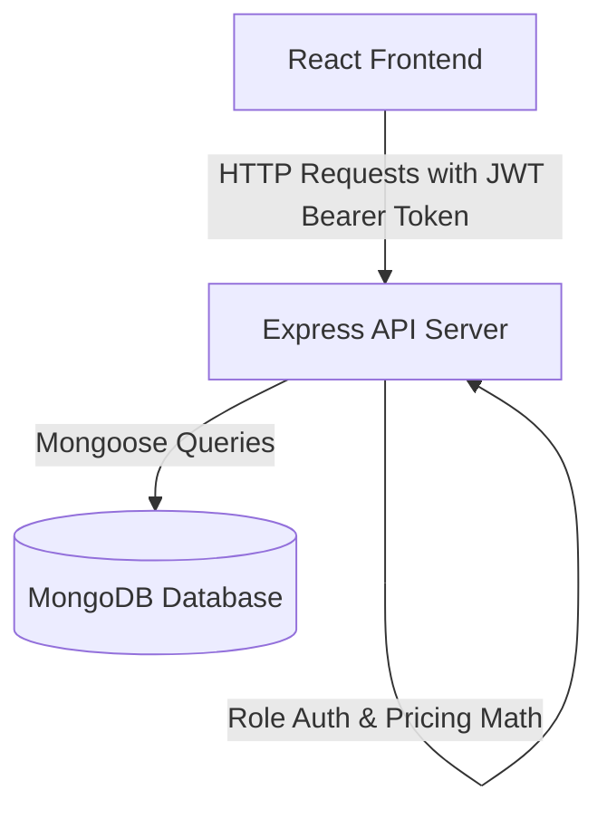

# MERN Inventory & Order Management System

A simplified, robust B2B inventory and order management system. Built specifically using the **MERN (MongoDB, Express, React, Node.js) Stack** with role-based access controls for **Administrators** and **Sellers**.

---

## Technical Stack & Architecture

- **Frontend**: React (Vite), React Router, Axios, Lucide React (Icons), and Custom Glassmorphic Vanilla CSS.
- **Backend**: Node.js, Express, JSON Web Token (JWT) Authentication, Bcrypt password hashing.
- **Database**: MongoDB (Mongoose Object Modeling) supporting local or Atlas instances.



---

## Database Schemas

### 1. User Schema (`User` Model)
Represents accounts and determines permissions.
- `name` (String, required): User's name.
- `email` (String, unique, required): Case-insensitive.
- `password` (String, required, select: false): Bcrypt hashed.
- `role` (String, enum: `['admin', 'seller']`, default: `'seller'`).

### 2. Product Schema (`Product` Model)
Stores catalog items and inventory levels.
- `name` (String, required): Product display name.
- `sku` (String, unique, required): Unique SKU code.
- `description` (String, optional).
- `unit` (String, enum: `['g', 'kg', 'L', 'mL', 'items']`, required): The fixed unit for this product.
- `pricePerUnit` (Number, required): Numeric price in INR per unit.
- `stockQuantity` (Number, required, default: 0): Available stock level in product unit.
- `category` (String, default: `'General'`).

### 3. Order Schema (`Order` Model)
Tracks sales proposals and quotation histories.
- `seller` (ObjectId ref User, required): The salesperson placing the quotation.
- `items` (Array):
  - `product` (ObjectId ref Product, required): Reference to product.
  - `quantity` (Number, required): Ordered quantity (must match product unit).
  - `unit` (String, required): Product's fixed unit.
  - `calculatedPrice` (Number, required): Total price for this item (Quantity × Price Per Unit).
- `totalAmount` (Number, required): Sum of item prices in INR.
- `status` (String, enum: `['pending', 'approved', 'completed', 'rejected']`, default: `'pending'`).

---

## Setup Instructions

### 1. Prerequisites
- **Node.js** (v18 or higher)
- **MongoDB** running locally (e.g. `mongodb://127.0.0.1:27017`) or a connection URI for **MongoDB Atlas** (cloud database).

### 2. Backend Setup
1. Navigate to the server folder:
   ```bash
   cd server
   ```
2. Open or configure the `.env` file inside `server/`:
   ```env
   PORT=5000
   MONGODB_URI=mongodb://127.0.0.1:27017/inventory-management
   JWT_SECRET=supersecretjwtkey12345
   ```
3. Start the backend server:
   ```bash
   npm run start
   ```
   The API will listen at `http://localhost:5000`.

### 3. Frontend Setup
1. Navigate to the client folder:
   ```bash
   cd client
   ```
2. Start the Vite React development server:
   ```bash
   npm run dev
   ```
   Navigate your browser to `http://localhost:5173`.

---

## Verification & Automated Testing
The backend features an automated database flow test that registers users, seeds inventory items, places orders, and verifies stock deductions directly:

1. Open a terminal inside the `server/` directory.
2. Run the command:
   ```bash
   node test_flow.js
   ```
3. A successful execution will output `>>> SUCCESS: ALL TESTS PASSED SUCCESSFULLY! <<<`.

---

## User Panels & Test Credentials

### Test Accounts
You can register new accounts in the UI register form, or use these pre-loaded accounts:

| Email | Password | Role | Description |
|---|---|---|---|
| `admin@test.com` | `password123` | **Admin** | Full management controls |
| `seller@test.com` | `password123` | **Seller** | Proposal creation and view catalog |

### 1. Seller Panel
- **My Dashboard**: View proposal summaries, active quotes, and approved sales value.
- **Create New Order**:
  - Search catalog items.
  - Add items to the basket (orders are placed directly in the product's unit).
  - See live price totals (Quantity × Rate) and stock availability warnings.
  - Submit the proposal.

### 2. Admin Panel
- **Admin Dashboard**: View inventory statistics (Total Products, Low Stock Watchlist, and Total Approved Sales).
- **Inventory CRUD**: Create, edit, adjust stock, or delete products.
- **Incoming Quotations Board**:
  - Review orders placed by sellers.
  - **Approve**: Subtracts quantities directly from product stock and sets status to approved.
  - **Reject**: Cancels the order (and reverts stock if it was already approved).
  - **Complete**: Finalizes fulfilled orders.
