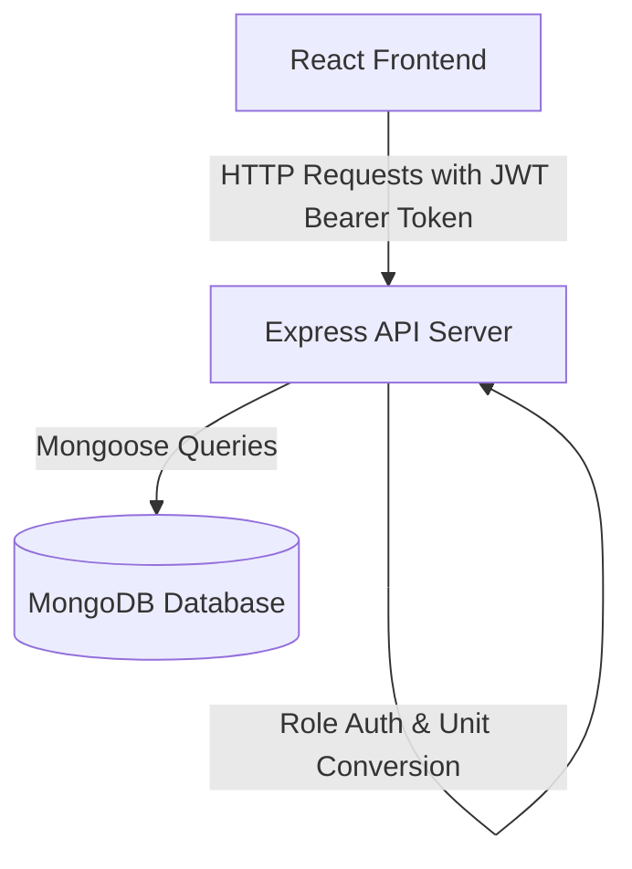

# MERN Inventory & Order Management System

A simplified, robust web application designed for managing product inventories, processing order quotations, and handling automatic unit conversions. Built specifically using the **MERN (MongoDB, Express, React, Node.js) Stack** with role-based access controls for **Administrators** and **Sellers**.

---

## Technical Stack & Architecture

- **Frontend**: React (Vite), React Router, Axios, Lucide React (Icons), and Custom Glassmorphic Vanilla CSS.
- **Backend**: Node.js, Express, JSON Web Token (JWT) Authentication, Bcrypt password hashing.
- **Database**: MongoDB (Mongoose Object Modeling) supporting flexible connections (local instance or MongoDB Atlas cloud).



---

## Database Schemas

### 1. User Schema (`User` Model)
Represents application accounts and determines layout permissions.
- `name` (String, required): User's full name.
- `email` (String, unique, required): Hashed lookup key (case-insensitive).
- `password` (String, required, select: false): Bcrypt hashed password.
- `role` (String, enum: `['admin', 'seller']`, default: `'seller'`): Determines dashboard access.

### 2. Product Schema (`Product` Model)
Stores catalog items and base rates.
- `name` (String, required): Product display name.
- `sku` (String, unique, required): Stock Keeping Unit string.
- `description` (String, optional): Information or notes.
- `baseUnit` (String, enum: `['g', 'kg', 'L', 'mL', 'items']`, required): Base unit of inventory storage.
- `pricePerBaseUnit` (Number, required): Numeric price in INR per 1 unit of `baseUnit`.
- `stockQuantity` (Number, required, default: 0): Available stock level in `baseUnit`. Handles high decimal precision.
- `category` (String, default: `'General'`): Catalog sorting category.

### 3. Order Schema (`Order` Model)
Tracks sales contracts and quotation history.
- `seller` (ObjectId ref User, required): The salesperson placing the quotation.
- `items` (Array):
  - `product` (ObjectId ref Product, required): Reference to catalog product.
  - `quantity` (Number, required): Quantity in the ordered unit.
  - `unit` (String, enum: `['g', 'kg', 'L', 'mL', 'items']`, required): The unit requested for order.
  - `calculatedPrice` (Number, required): Total price for this line item in INR.
- `totalAmount` (Number, required): Sum of line item prices in INR.
- `status` (String, enum: `['pending', 'approved', 'completed', 'rejected']`, default: `'pending'`): Lifecycle of quotation.

---

## Unit Storage & Conversion Strategy

### Dimensions & Scaling Factors
Units are divided into distinct dimensions. Conversions are only allowed between units of the same dimension:

| Dimension | Unit | Description | Factor (Relative to Base) |
|---|---|---|---|
| **WEIGHT** | `g` | grams | 1 (Reference) |
| **WEIGHT** | `kg` | kilograms | 1000 |
| **VOLUME** | `mL` | milliliters | 1 (Reference) |
| **VOLUME** | `L` | liters | 1000 |
| **COUNT** | `items` | units/counts | 1 (Reference) |

### Conversion Formulas
1. **Quantity Conversion**:
   When converting from unit $A$ to unit $B$:
   $$\text{qty}_B = \text{qty}_A \times \left(\frac{\text{factor}_A}{\text{factor}_B}\right)$$
   *Example*: Converting $1.5\text{ L}$ (factor 1000) to $\text{mL}$ (factor 1):
   $$1.5 \times \left(\frac{1000}{1}\right) = 1500\text{ mL}$$

2. **Price Calculation**:
   Given an order quantity $\text{qty}_{\text{order}}$ in unit $U_{\text{order}}$, for a product with base unit $U_{\text{base}}$ and price $P_{\text{base}}$:
   $$\text{qty}_{\text{base}} = \text{qty}_{\text{order}} \times \left(\frac{\text{factor}_{\text{order}}}{\text{factor}_{\text{base}}}\right)$$
   $$\text{Price} = \text{qty}_{\text{base}} \times P_{\text{base}}$$
   *Example*: Product is stored in `kg` with a price of ₹500/kg. A user orders `250 g`:
   $$\text{qty}_{\text{base}} = 250 \times \left(\frac{1}{1000}\right) = 0.25\text{ kg}$$
   $$\text{Price} = 0.25 \times 500 = \text{₹}125$$

### Storage & Precision
- All numeric quantities, conversion rates, and pricing figures are stored as high-precision JS **Numbers** (double-precision floating points) in MongoDB, which handles up to 15-17 decimal digits.
- To prevent floating-point rounding errors during pricing displays, final line item prices are rounded to a maximum of 4 decimal places before save, and formatted to 2 decimal places in the user interface.

---

## Setup Instructions

### 1. Prerequisites
- **Node.js** (v18 or higher recommended)
- **MongoDB** running locally (e.g. `mongodb://127.0.0.1:27017`) or a connection URI for **MongoDB Atlas** (cloud database).

### 2. Backend Setup
1. Open a terminal and navigate to the server folder:
   ```bash
   cd server
   ```
2. Open or configure the `.env` file inside `server/`:
   ```env
   PORT=5000
   MONGODB_URI=mongodb://127.0.0.1:27017/inventory-management
   JWT_SECRET=supersecretjwtkey12345
   ```
   *(Note: You can replace the local URI with a MongoDB Atlas URL if running in the cloud).*
3. Start the backend server:
   ```bash
   npm run start
   ```
   The backend will start listening at `http://localhost:5000`.

### 3. Frontend Setup
1. Open a new terminal and navigate to the client folder:
   ```bash
   cd client
   ```
2. Start the Vite React development server:
   ```bash
   npm run dev
   ```
   Open your browser and navigate to `http://localhost:5173`.

---

## Verification & Automated Testing
The backend features a fully automated database flow test that registers users, populates inventory items, places orders using converted units, and verifies stock deductions:

1. Open a terminal inside the `server/` directory.
2. Run the command:
   ```bash
   node test_flow.js
   ```
3. A successful execution will output `>>> SUCCESS: ALL TESTS PASSED SUCCESSFULLY! <<<`, verifying the system's mathematics and database transactions.

---

## Guide to Roles & User Panels

### Quick Test Credentials
You can register new accounts directly from the UI register form, or use these pre-loaded accounts if you run `node test_flow.js` first:

| Email | Password | Role | Description |
|---|---|---|---|
| `admin@test.com` | `password123` | **Admin** | Access to all management controls |
| `seller@test.com` | `password123` | **Seller** | Access to catalog and order proposals |

### 1. Seller Panel
- **My Dashboard**: View a summary of orders placed, active proposals pending review, and approved revenue totals.
- **Create New Order**:
  - Browse/search catalog items.
  - Select items to add them to the order basket.
  - Choose quantities and units (e.g. order a kilograms-based chemical in grams, or a liters-based acid in milliliters).
  - See immediate price computations in INR and validation warnings if stock is exceeded.
  - Submit the proposal.

### 2. Admin Panel
- **Admin Dashboard**: View widgets summarizing inventory statistics (Total Products, Low Stock Watchlist, and Total Approved Sales).
- **Inventory CRUD**:
  - Create new products, configuring base units, base rates, SKUs, and categories.
  - Update product fields, adjust stock levels, or delete records.
- **Incoming Quotations Board**:
  - Review orders placed by sellers.
  - Inspect ordered quantities vs. base storage levels and calculated pricing.
  - **Approve**: Subtracts quantities (converted to base units) from product stock and marks order as approved.
  - **Reject**: Reverts approval (returning stock to product inventory) or cancels the request.
  - **Complete**: Finalizes approved orders.

---

## Vercel Deployment Instructions

### 1. Deploy Backend API
You can deploy the backend to platforms like **Render**, **Fly.io**, or **Vercel** (with serverless functions):
1. Push the code to a Git repository.
2. Set environment variables on the hosting platform:
   - `MONGODB_URI`: Set to your MongoDB Atlas connection string.
   - `JWT_SECRET`: A secure random secret key.
   - `PORT`: Set to `5000` or standard environment port.

### 2. Deploy Frontend Client on Vercel
1. Set up a Vercel account.
2. Install the Vercel CLI locally or connect your GitHub repository to Vercel.
3. If using Vercel CLI, run inside the `client/` folder:
   ```bash
   vercel
   ```
4. Set the API URL configuration in React to point to your live backend endpoint by updating the `API_URL` variable in `client/src/context/AppContext.jsx`.
5. Trigger a production build:
   ```bash
   vercel --prod
   ```
